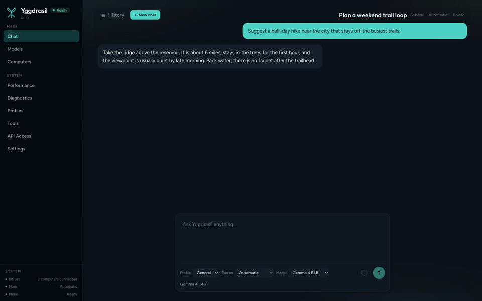

# Yggdrasil Core

Headless local-AI orchestration for the computers you already own.

Yggdrasil Core runs on a machine, manages local inference runtimes and models, and can pair with other computers on the same network. Clients talk to it over HTTP, including an OpenAI-compatible API.

**Status:** Beta. The latest tag in this repository is `v1.2.0-beta.3`. A build from source reports `0.1.0-dev` unless the version is set with `-ldflags`.

**Platforms:** macOS, Windows, and Linux. Packaged releases today are macOS headless archives and Linux `.deb` / `.rpm` packages. See [Supported platforms](#supported-platforms).

**Site:** [yggdrasil.yeix.io](https://yggdrasil.yeix.io) — Yggdrasil Desktop, this Core project, documentation, and Core downloads.

**Start here:** [Quick start](#quick-start) · [Documentation](#documentation)

Copyright (C) 2026 YEIXIO LLC. Source code is [AGPL-3.0-or-later](LICENSE). Trademarks are not included; see [TRADEMARKS.md](TRADEMARKS.md).

## What is Yggdrasil Core?

Yggdrasil Core is infrastructure. It is the daemon (`yggdrasil-daemon`), a local web UI served by that daemon, and the HTTP API in front of local models.

It is not a hosted chat product. Yggdrasil Desktop and Yggdrasil Mobile are separate clients and are not developed in this repository.

## Why Yggdrasil?

Local models are tied to the runtime and the computer that can hold them. Yggdrasil Core keeps that work on machines you control:

- it detects CPU, memory, disk, and accelerators on the host
- it installs GGUF models and a managed llama.cpp runtime
- it discovers and pairs other Yggdrasil computers on the LAN
- it places Team roles onto paired machines that can run them
- it exposes a loopback API that other programs can call

## Features

These exist in this repository today:

- headless daemon, with an optional local web UI
- hardware detection on macOS, Windows, and Linux
- GGUF model catalog, Hugging Face search, download, start, and stop
- llama.cpp (`llama-server`) runtime adapter, plus an adapter for an external OpenAI-compatible server
- profiles, a simple orchestrator, and a Team orchestrator (coordinator, worker, reviewer)
- Bifrost discovery, pairing, and node-to-node calls
- Norn workload placement across paired nodes
- health endpoint, model health checks, diagnostics bundle, and a local event stream
- benchmarks against a running local model
- OpenAI-compatible `GET /v1/models` and `POST /v1/chat/completions`
- tools for web search, files, shell, and git, each gated by a profile policy

Background work that exists today is operational: idle model unload, model health checks, and periodic peer refresh. There is no user-facing job scheduler.

## Quick start

Requirements for a source build: Go 1.26.3 or newer, Node.js 22, and pnpm 9.

```bash
git clone https://github.com/yeixio/yggdrasil-core.git
cd yggdrasil-core
make frontend
make daemon
./bin/yggdrasil-daemon
```

Open `http://127.0.0.1:7331`. The API listens on `127.0.0.1:7331` by default. The first page can install a runtime and a GGUF model. After a model is running, the examples under [examples/](examples/) call `/v1/chat/completions`.

`make frontend` installs web dependencies, runs the web tests, and writes `web/dist`. The daemon serves that directory when it finds `index.html` there.

### Published packages

Tagged releases attach macOS headless archives, Linux `.deb` and `.rpm` packages, and `SHA256SUMS.txt`. See [GitHub Releases](https://github.com/yeixio/yggdrasil-core/releases) and [packaging/release-install.md](packaging/release-install.md).

macOS can install Core with Homebrew. This tap is the Core daemon, not Yggdrasil Desktop, and not the separate Homebrew cask named `yggdrasil`.

```bash
brew tap yeixio/yggdrasil https://github.com/yeixio/yggdrasil-core
brew install yeixio/yggdrasil/yggdrasil
yggdrasil-daemon
```

Open `http://127.0.0.1:7331`. A tagged release writes `Formula/yggdrasil.rb` and merges it to `main`.

The same workflow publishes an apt repository on the `apt` branch. Debian and Ubuntu instructions are in [packaging/linux/README.md](packaging/linux/README.md).

The next tagged release also builds `yggdrasil-<version>-windows-amd64-headless.tar.gz`. Releases cut before that change do not include it. Windows can be built from source today. Core release archives are not code-signed.

Dockerfiles in this repository are for development and the cluster check. There is no published application image.

## The interface

The daemon serves this web UI at `http://127.0.0.1:7331`. `make screenshots` recaptures the images and the walkthrough below from demo data. It does not start a model.

[](docs/screenshots/demo.mp4)

| | |
| --- | --- |
|  |  |
| Chat | Models |
|  |  |
| Computers | Performance |
|  |  |
| Diagnostics | API access |

## Multi-computer architecture

Each computer runs its own daemon.

```text
client
  |
HTTP  (127.0.0.1:7331 by default)
  |
yggdrasil-daemon
  |
runtime adapters
  |
local inference (llama.cpp, or a configured external server)
```

On the network, Bifrost is the node protocol (port 7332). Discovery uses mDNS (`_localai._tcp`) and can use static peers when mDNS is unavailable. Pairing exchanges a consent step and then authenticates later node calls with certificates. Norn chooses which paired computer runs a role. Details are in [docs/architecture.md](docs/architecture.md) and [docs/clustering.md](docs/clustering.md). A manual two-machine check is in [docs/two-machine-team-demo.md](docs/two-machine-team-demo.md).

## OpenAI-compatible API

Base URL: `http://127.0.0.1:7331`

On the default loopback bind these routes do not require a key. If the daemon listens on any other address, send `Authorization: Bearer YOUR_API_KEY` on `/v1` and on `/api/v1`.

```bash
curl http://127.0.0.1:7331/v1/models
```

```bash
curl http://127.0.0.1:7331/v1/chat/completions \
  -H 'Content-Type: application/json' \
  -d '{"model":"profile:general-assistant","messages":[{"role":"user","content":"Hello"}]}'
```

`/v1/models` lists profiles as `profile:<id>`. Chat accepts that id or a model id. Streaming uses server-sent events and ends with `data: [DONE]`. Compatibility limits are in [docs/api.md](docs/api.md). Runnable examples are in [examples/](examples/).

## Supported platforms

| Platform | How to run it |
| --- | --- |
| macOS Apple Silicon and Intel | Source build, or a darwin headless archive from Releases |
| Linux amd64 and arm64 | Source build, `.deb`, or `.rpm` |
| Windows amd64 | Source build. A headless archive is produced on the next tagged release |

## Supported hardware

The daemon inventories the host on macOS, Windows, and Linux, including NVIDIA, AMD, Intel, and Apple GPUs when the platform probes succeed. That is detection code, not a promise that inference has been measured on every combination. The matrix and the gaps are in [docs/compatibility.md](docs/compatibility.md). A hardware report is a useful contribution.

## Supported runtimes

| Runtime id | What it is | Status |
| --- | --- | --- |
| `llamacpp` | Managed `llama-server` from llama.cpp GitHub releases. Models are GGUF. | Implemented |
| `external-openai` | A remote OpenAI-compatible base URL you configure. It is not installed as a local binary. | Implemented |

llama.cpp asset selection is per OS and CPU architecture. The Windows asset the installer looks for is `bin-win-cpu-x64`. Capability reporting can still list Vulkan or CUDA as possible backends. See [docs/runtimes.md](docs/runtimes.md).

## CLI examples

The daemon is `yggdrasil-daemon`. The helper in this repository is `yggctl`, built from `cmd/devctl`.

```bash
go build -o bin/yggdrasil-daemon ./cmd/daemon
go build -o bin/yggctl ./cmd/devctl
./bin/yggdrasil-daemon -version
./bin/yggctl version
./bin/yggctl about
./bin/yggctl paths
```

`yggctl version` and `yggctl about` print the same corresponding-source notice: version, AGPL license, source URL, and commit. `yggdrasil-daemon -version` prints that notice and exits. `yggctl paths` prints the default data, model, runtime, log, and database directories. There is no `yggctl status`, `nodes`, or `models` command. Those queries are HTTP routes under `/api/v1/`. A fuller CLI is listed on the [roadmap](ROADMAP.md).

`./bin/yggdrasil-daemon -data-dir /path/to/dir` overrides the data directory.

## Configuration

On first start the daemon writes `config.json` in the data directory. Defaults:

| | |
| --- | --- |
| API | `127.0.0.1:7331` |
| Bifrost | port `7332` (bound on all interfaces when discovery is on, which is the default) |
| Web UI | enabled, if a built UI is found |
| LAN API | off |
| Discovery | on |

Data directories:

| OS | Path |
| --- | --- |
| macOS | `~/Library/Application Support/Yggdrasil` |
| Windows | `%LOCALAPPDATA%\Yggdrasil` |
| Linux | `$XDG_DATA_HOME/yggdrasil` or `~/.local/share/yggdrasil` |

Models, runtimes, logs, `yggdrasil.db`, and a `secrets/` directory live under that path. `YGGDRASIL_*` environment variables override bind addresses, node identity, static peers, and discovery for Docker or CI. See [docs/privacy.md](docs/privacy.md).

## Security and privacy

Yggdrasil Core does not send usage telemetry by default. A search of this repository found no analytics, crash-reporting, or metrics-upload client.

The control API and the OpenAI-compatible API require a bearer token whenever the daemon listens beyond loopback. Loopback access stays open by default. Yggdrasil refuses a non-loopback API until a key is configured. Enabling local network access records `0.0.0.0`; the socket changes on the next start, and the key check follows the configured host immediately. The Docker image sets `YGGDRASIL_API_HOST=0.0.0.0` and needs `YGGDRASIL_API_KEY`. A key on plain HTTP does not encrypt traffic. Bifrost listens for pairing on the LAN when discovery is enabled. Read [docs/privacy.md](docs/privacy.md) and [SECURITY.md](SECURITY.md) before exposing either port.

## Documentation

| | |
| --- | --- |
| [Architecture](docs/architecture.md) | Subsystems and process layout |
| [API](docs/api.md) | Control plane and OpenAI-compatible routes |
| [Runtimes](docs/runtimes.md) | llama.cpp and external servers |
| [Clustering](docs/clustering.md) | Discovery, pairing, placement |
| [Compatibility](docs/compatibility.md) | Hardware matrix |
| [Privacy](docs/privacy.md) | What stays local and what can leave |
| [Development](docs/development.md) | Build, test, and CI |
| [Troubleshooting](docs/troubleshooting.md) | First checks when something fails |
| [Capabilities](docs/capabilities.md) | Internet, Files, Shell, and Git |
| [Tools](docs/tools.md) | Tool registry and permissions |
| [User guide](docs/user-guide/README.md) | Source for the public guide |
| [Roadmap](ROADMAP.md) | Now, next, and research |

The public site is [yggdrasil.yeix.io](https://yggdrasil.yeix.io). It reads the version index, guide snapshots, the latest GitHub release, and [`site/content.json`](site/content.json) from this repository.

## Roadmap

[ROADMAP.md](ROADMAP.md) separates what is in progress from research topics. It does not promise dates.

## Contributing

Hardware reports, runtime notes, documentation, and code all help. Read [CONTRIBUTING.md](CONTRIBUTING.md) before opening a pull request. Code contributions are covered by the [Yggdrasil Contributor License Agreement](CLA.md).

Security reports should stay off public issues. See [SECURITY.md](SECURITY.md).

## Yggdrasil Desktop

Yggdrasil Core is the open-source engine. You can run the daemon and the web UI in this repository directly.

Yggdrasil Desktop and Yggdrasil Mobile are separate products. They are clients for people who want a packaged application. This repository does not contain their source. Desktop release artifacts are built outside this tree. The public site describes both products at [yggdrasil.yeix.io](https://yggdrasil.yeix.io).

## License

[GNU Affero General Public License v3.0 or later](LICENSE). SPDX identifier: `AGPL-3.0-or-later`.

The copyright notice is in [NOTICE](NOTICE). Brand use is described in [TRADEMARKS.md](TRADEMARKS.md).

## Support Yggdrasil Core

If Yggdrasil Core is useful to you, you can support continued development through [GitHub Sponsors](https://github.com/sponsors/gopherstein). Contributions, testing, bug reports, documentation, and hardware compatibility reports are also valuable ways to support the project.

Nothing in the software is gated on a donation.

Questions, bugs, and ideas belong in GitHub Issues. A map of where to write is in [SUPPORT.md](SUPPORT.md).

Yggdrasil Core is open source and community contributions are welcome. Hardware reports, runtime integrations, bug reports, documentation improvements, and code contributions all help make local AI work across more systems.
