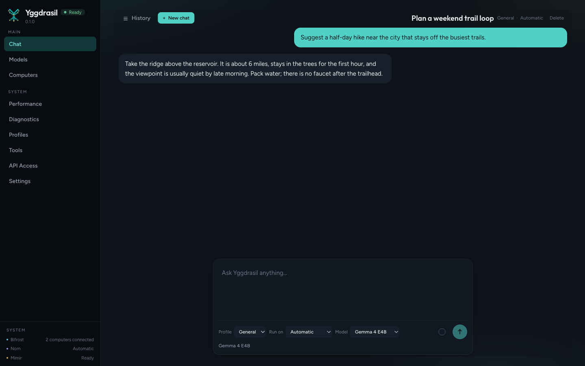
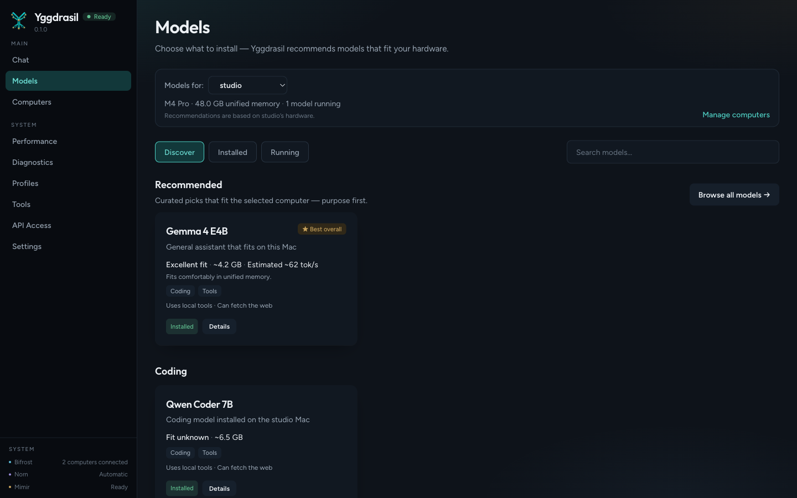
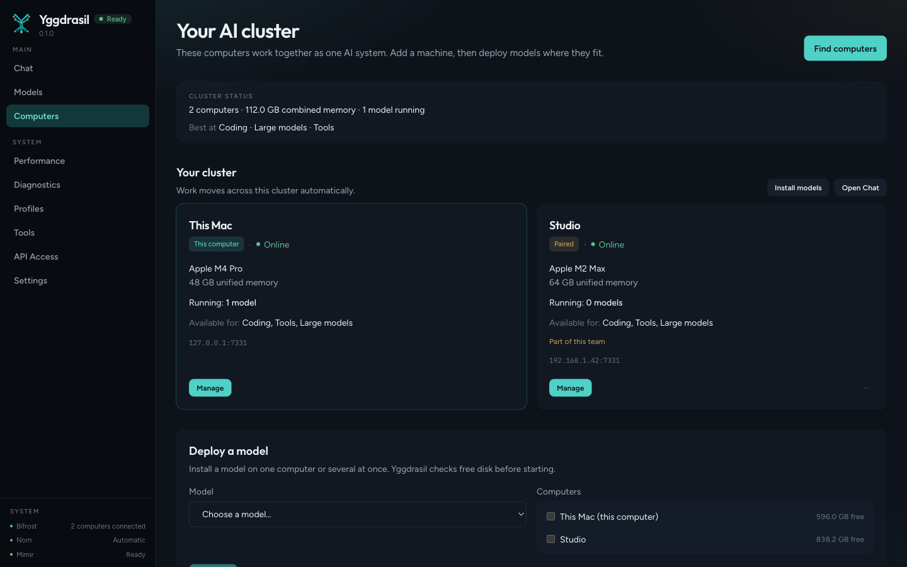
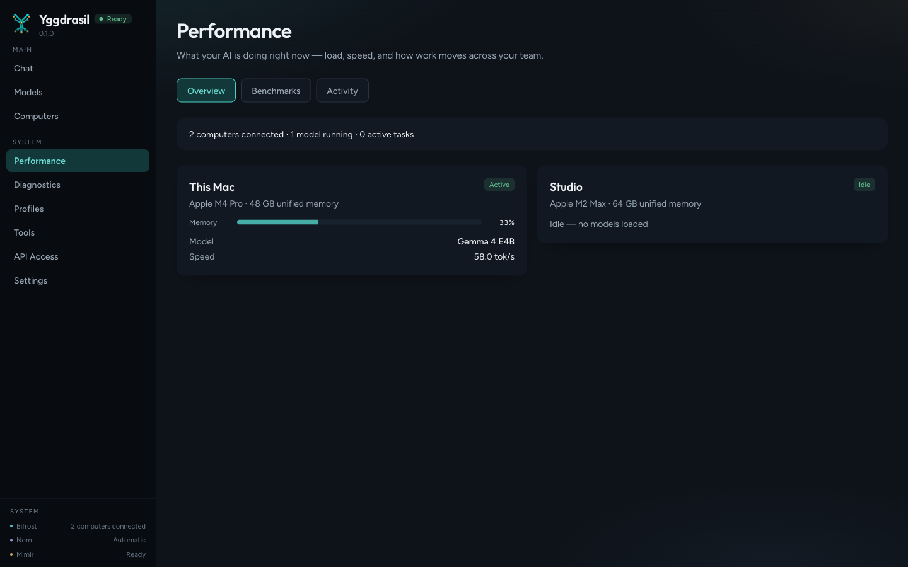
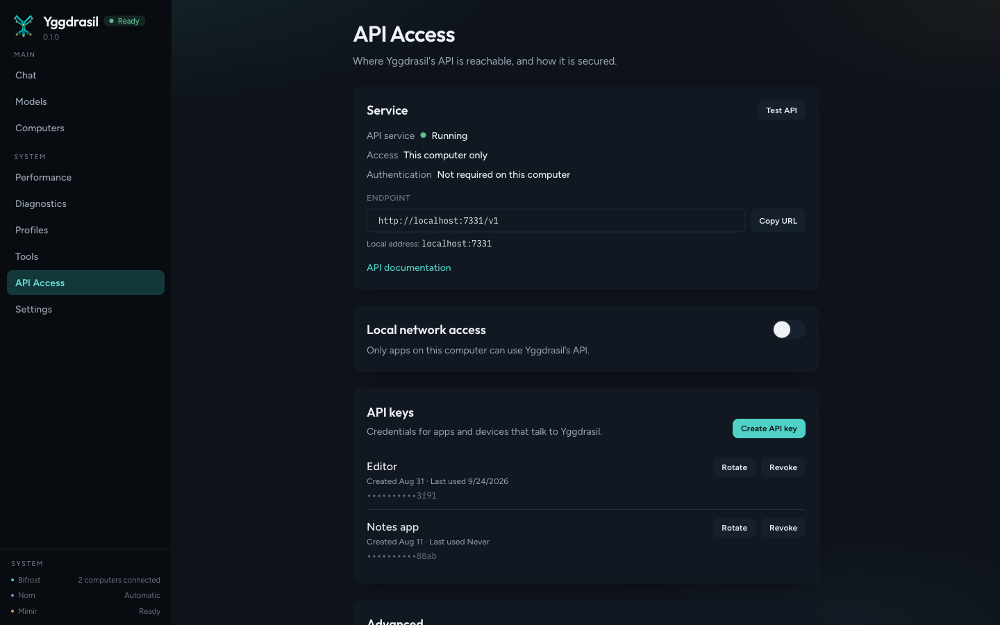

# Yggdrasil core

Local AI daemon and web UI for macOS, Windows, and Linux.

The daemon runs on this computer, serves the web UI, installs local models, and exposes an OpenAI-compatible API on loopback. Desktop installers are built separately and are not part of this repository.

Copyright (C) 2026 YEIXIO LLC. Licensed under the GNU Affero General Public License, version 3 or any later version. See [LICENSE](./LICENSE).

## Install

A release tag publishes packages to [GitHub Releases](https://github.com/yeixio/yggdrasil-core/releases).

macOS:

```bash
brew tap yeixio/yggdrasil https://github.com/yeixio/yggdrasil-core
brew install yggdrasil
```

Debian and Ubuntu. The apt repository is the `apt` branch of this repository:

```bash
echo "deb [trusted=yes] https://raw.githubusercontent.com/yeixio/yggdrasil-core/apt stable main" | sudo tee /etc/apt/sources.list.d/yggdrasil.list
sudo apt-get update
sudo apt-get install yggdrasil
```

RPM packages for x86_64 and aarch64 are attached to the same release:

```bash
sudo dnf install ./yggdrasil-*.rpm
```

The packages install `yggdrasil-daemon` and the web UI, and start a systemd service on Linux. Open `http://127.0.0.1:7331`.

## The interface

These screens are the web UI the daemon serves at `http://127.0.0.1:7331`. `make screenshots` recaptures them from demo data; it does not start a model.

| | |
| --- | --- |
|  |  |
| Chat | Models |
|  |  |
| Computers | Performance |
|  |  |
| Diagnostics | API access |

## Run it

Requirements: Go 1.26+, Node 22+, pnpm 9+.

```bash
make daemon
./bin/yggdrasil-daemon
```

Open `http://127.0.0.1:7331`. The development UI proxy is `make run-web` at `http://127.0.0.1:5173`.

Headless package for this machine:

```bash
VERSION=1.0.0 make package-headless
```

## Documentation and website

User documentation and the public site copy live in this repository.

| Path | Purpose |
|------|---------|
| [docs/user-guide/guide.json](./docs/user-guide/guide.json) | Editable user guide |
| [docs/index.json](./docs/index.json) | Versions the website lists |
| `docs/<version>.json` | Frozen guide for one release |
| [site/content.json](./site/content.json) | Public site copy |
| [docs/capabilities.md](./docs/capabilities.md) | Internet, Files, Shell, and Git |
| [docs/tools.md](./docs/tools.md) | Tool registry and permissions |

The site at `https://yggdrasil.yeix.io` reads the version index, the guide snapshots, the latest GitHub release, and `site/content.json` from this repository.

## License

This program is free software: you can redistribute it and/or modify it under the terms of the GNU Affero General Public License as published by the Free Software Foundation, either version 3 of the License, or (at your option) any later version.

This program is distributed in the hope that it will be useful, but WITHOUT ANY WARRANTY; without even the implied warranty of MERCHANTABILITY or FITNESS FOR A PARTICULAR PURPOSE. See the GNU Affero General Public License for more details.
